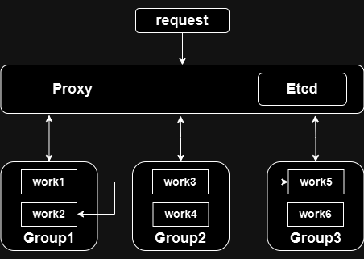
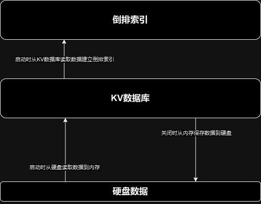
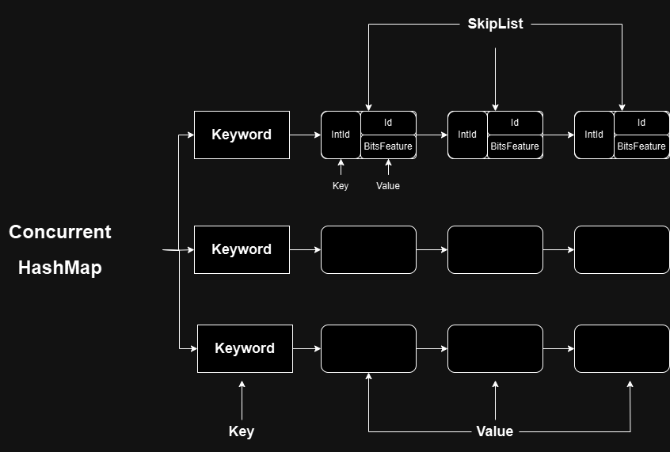

# VeliSearch-分布式搜索引擎
VeliSearch是一个使用go语言开发的分布式，高性能，可扩展的搜索引擎。
## 分布式架构

### Worker

### 倒排索引

## 目录结构
```
│  .gitignore
│  go.mod
│  go.sum
│  makefile
│  README.md
│
├─docs # 文档
│
├─index_service
│  │  Iindexer.go # worker接口
│  │  index.pb.go # proto rpc 文件
│  │  indexer_worker.go # 单机worker
│  │  indexer_worker_service.go # worker服务
│  │  sentinel.go # sentinel 集群worker
│  │
│  ├─load_balancer
│  │      load_balancer.go # 负载均衡器
│  │      random_load.go # 随机负载均衡
│  │      round_robin.go # 轮询负载均衡
│  │
│  ├─proto
│  │      index.proto # proto文件
│  │
│  └─service_hub
│          etcd_service_hub.go # etcd 服务中心
│          hub_proxy.go # 服务代理
│          service_hub.go # 服务中心接口
│
├─internal
│  ├─kv_db
│  │      badger_kv_db.go  # badger db
│  │      bbolt_kv_db.go # bbolt db
│  │      kv_db.go # kv db接口
│  │
│  ├─reverse_index
│  │      reverse_index.go # 倒排索引接口
│  │      skiplist_reverse_index.go # skiplist倒排索引
│  │
│  └─test
│          kv_db_test.go # kv db测试
│
├─types
│  │  doc.go 
│  │  doc.pb.go # 文档类型
│  │  term_query.go 
│  │  term_query.pb.go # 搜索类型
│  │
│  └─proto
│          doc.proto
│          term_query.proto
│
└─util
        bits.go # 位操作
        concurrent_hash_map.go # 并发安全的map
        logger.go # 日志
        net.go # 网络相关
```
